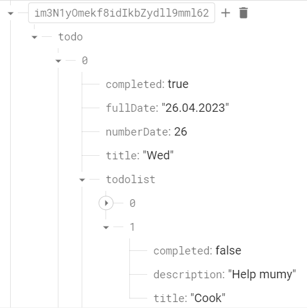

<h1>Innowise Task 8</h1>

This is task 8 for an internship for a Vue developer position. Here is a Clever to-do list. 
<a href="https://drive.google.com/file/d/18I1PxOxZn2lwm__YeOtMNoWeiXygKwwN/view">Description of the task.</a>

<h2>How to run the app</h2>

First of all you need to clone the project. Copy the Clone Url of the repository, go to the terminal and type "git clone *url*". After that, enter "npm i" into the terminal - to install all dependencies and plugins. Now everything is ready to launch the application! Just type "npm run build" into the terminal and after "npm run serve" you will see the application page open in your browser.

<h2>Project structure</h2>

    ├──./public/ │   ├──index.html │   ├──index.html 
    ├──./src/ │   ├──/assets/ │   │   ├──/css/ │   │   ├──/img/ 
                  │   ├──/components/ 
                  │   ├──/pages/ 
                  │   ├──/router/ 
                  │   ├──/stores/ 
                  │   ├──App.vue 
                  │   ├──firebase.config.js 
                  │   └──main.js 
     ├──babel.config.js ├──.eslitrc.json  ├──package-lock.json ├──package.json ├──jsconfig.json ├──README.md ├──vue.config.js └──.gitignore

<h2>Database snapshot</h2>

<h2>Application stack</h2>

    •Vue
•Pinia
•Toastify
•Firebase
•ESLint
•Router
SCSS

