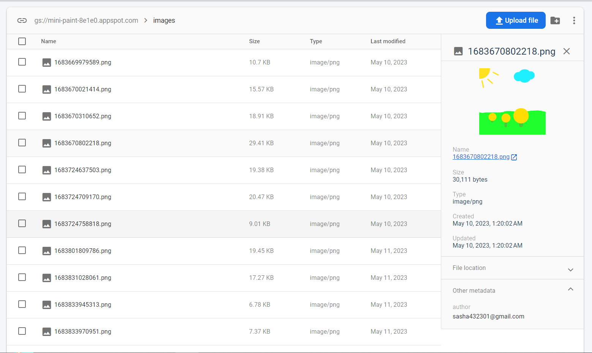

<h1>Innowise Task 9</h1>

This is task 9 for an internship for a Vue developer position. Here is a Mini-paint. 
<a href="https://drive.google.com/file/d/19cb4whI_HUVPzuaPyaj5r6hGotIVnhho/view?pli=1">Description of the task.</a>

<h2>How to run the app</h2>

First of all you need to clone the project. Copy the Clone Url of the repository, go to the terminal and type "git clone *url*". After that, enter "npm i" into the terminal - to install all dependencies and plugins. Now everything is ready to launch the application! Just type "npm run serve" you will see the application page open in your browser.

<h2>Project structure</h2>

    ├──./public/ │   ├──index.html 
    ├──./src/    │   ├──/assets/ │   │   ├──/css/ │   │   ├──/img/ 
                  │   ├──/components/ 
                  │   ├──/pages/ 
                  │   ├──/plugins/ 
                  │   ├──/models/ 
                  │   ├──/router/ 
                  │   ├──/services/ 
                  │   ├──/stores/ 
                  │   ├──App.vue 
                  │   └──main.ts 
     ├──babel.config.js ├──.eslitrc.json  ├──package-lock.json ├──package.json ├──jsconfig.json ├──README.md ├──vue.config.js └──.gitignore

<h2>Database snapshot</h2>

This is an example of how the database looks like.

<h2>Application stack</h2>

    •Vue •TypeScript •Pinia •Toastify •Firebase •ESLint •Router •SCSS 

